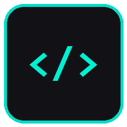

<p align="center">
  
</p>

# SuitCode

**Your coding agent actually knows your codebase. Not guesses — knows.**

> **Measured across two real multi-day sessions on a polyglot monorepo (Go backend + TypeScript/React frontend + C# Avalonia desktop):**
> - **15.9× average compression ratio** across 26 logged feature calls — 500-file repo → 8–15 files loaded per call
> - **~60% of feature calls directly preceded code edits** across 138 total calls over 3 days
> - **Largest single chain:** 57 files created from one context capsule (the entire cross-platform desktop scaffold)
> - **28 development phases** completed end-to-end with no manual file hunting

---

## The problem with AI coding agents

When Claude Code, Codex, or Cursor reads your repo, they do text search.
They find files by name patterns and keyword matches.
They guess what's related based on proximity and conventions.

That's fine for a demo. In a real codebase with 500+ files, it means:
- Loading 200 files when only 12 are relevant
- Missing the file that actually imports the one you're changing
- Hitting token limits before reaching the code that matters
- Hallucinations caused by irrelevant context crowding out the real signal

## What SuitCode does differently

SuitCode speaks your toolchain. It doesn't guess — it asks the tools your language already has:

| Signal | Source | Certainty |
|--------|--------|-----------|
| Which files import this one | `go/packages`, TypeScript compiler, Python AST | **Authoritative** |
| What tests cover this code | Import graph + naming conventions | **Authoritative** |
| What breaks if this changes | Reverse import graph (full transitive) | **Authoritative** |
| Symbol definitions and types | `gopls` LSP | **Authoritative** |

SuitCode never returns a result it can't back with a verified signal. If the import graph isn't available, it says so — it does **not** fall back silently to a regex scan and pretend that's the same thing. Every result carries its provenance.

---

## Real-world validation

We ran SuitCode across two multi-day Claude Code sessions building a full cross-platform product: a Go/TypeScript web backend and a C# Avalonia desktop client. The sessions covered 3 languages simultaneously, 28 development phases, and 3,219 conversation turns.

**Session 2 — 3 days, 138 calls, polyglot (Go + TypeScript/React + C# Avalonia):**

- **15.9× average compression** — the agent's own `suitcode . metrics summary` at session end: _"26 calls · avg 6,056 tokens · 15.9× compression ratio"_
- **~60% of feature calls directly preceded code edits**
- **Largest single chain:** one context capsule → 57 files created (the entire desktop scaffold: ViewModels, Views, Services, API client, themes, tests)
- **Consistent cadence:** context → 2–43 turns → edits, across all 28 phases
- **Import graph quality confirmed:** agent explicitly noted _"csharp-ls is resolving imports"_ and _"Import graph is accurate and complete"_ after csharp-ls was installed

**Session 1 — 2 days, 89 calls, C# codebase:**

- ~54% of feature calls directly preceded code edits (rising to ~4/5 once agent calibrated)
- Highest-signal calls each preceded 1–66 files edited

These are real sessions, not benchmarks. SuitCode includes a built-in session analysis tool so you can measure your own sessions — no manual instrumentation needed.

---

## Quick install

**Requires:** Go 1.21+

### Without tray icon

```sh
# macOS / Linux
curl -sSfL https://raw.githubusercontent.com/GreenFuze/SuitCode/main/install.sh | sh

# Windows (Command Prompt)
curl -sSfL https://raw.githubusercontent.com/GreenFuze/SuitCode/main/install.bat -o install.bat && install.bat && del install.bat
```

### With desktop tray icon

```sh
# macOS / Linux
curl -sSfL https://raw.githubusercontent.com/GreenFuze/SuitCode/main/install.sh | sh -s -- --tray

# Linux — install AppIndicator first, then run the line above
sudo apt install libayatana-appindicator3-dev   # Debian/Ubuntu
sudo dnf install libayatana-appindicator3-devel # Fedora

# Windows (Command Prompt)
curl -sSfL https://raw.githubusercontent.com/GreenFuze/SuitCode/main/install.bat -o install.bat && install.bat --tray && del install.bat
```

All binaries land in `$GOPATH/bin` (usually `~/go/bin` or `%USERPROFILE%\go\bin`).  
The coordinator auto-starts on first use — no config, no daemon management.

**CI / headless servers** — CGo-free, no tray:

```sh
curl -sSfL https://raw.githubusercontent.com/GreenFuze/SuitCode/main/install.sh | sh -s -- --ci
```

**Install scripts are also in the repo root** if you prefer to clone first:

```sh
./install.sh           # macOS / Linux, no tray
./install.sh --tray    # macOS / Linux, with tray
install.bat            # Windows, no tray
install.bat --tray     # Windows, with tray
```

---

## Why SuitCode?

### For agents that need to stay within token budgets

Every SuitCode response comes with a **token budget** you control. Ask for 8,000 tokens of context — SuitCode returns the highest-signal files that fit, ordered by import-graph proximity to your seed files. The rest of the repo doesn't enter the LLM's context window at all.

```sh
suitcode . context \
  --files internal/auth/auth.go,internal/auth/tokens.go \
  --budget 8000
```

Typical compression ratio: **10–40×**. 500-file repo → 15 files in context.

The budget model is tiered:

- **Tier 1 (critical path):** seeds, direct imports, and production importers — always included regardless of budget
- **Tier 2 (contextual):** package peers and test files — included up to remaining budget, pruned when tight

When Tier 2 is trimmed, SuitCode reports the exact `--budget` value needed to include everything:

```
contextual_trimmed: 3 peer/test file(s) omitted (1240 tokens) — use --budget 9240 to include all structurally related files
```

### For agents working across languages

SuitCode is polyglot from day one. In a repo with a Go backend, TypeScript frontend, and Python scripts, SuitCode runs all three import-graph providers simultaneously and merges the results. No "pick one language" compromise.

### For multi-module monorepos

Go workspaces with 16 plugin modules? SuitCode walks every `go.mod` and builds a unified cross-module import graph. A plugin importing from the core module shows as a direct edge — not missing data.

### For teams, not just solo devs

SuitCode runs as a local daemon. Every agent that needs context hits the same coordinator — investigators are shared per project, warmed once, served to everyone. No re-indexing per-session.

---

## What the agents see

### Context capsule

```sh
suitcode . context --files src/game/game.ts --budget 6000
```

Returns a ranked list of files that are likely relevant to editing `game.ts`:
- Files it directly imports (import graph — authoritative)
- Files that import it (reverse edges — authoritative)
- Co-located test files (naming convention — labeled as such)
- Related files in the same module

Each file entry includes: path, language, role, token estimate, and **provenance** — exactly how SuitCode decided it was relevant.

### Blast radius

```sh
suitcode . impact --files internal/store/store.go --git-ref HEAD~1
```

Shows every file that transitively depends on what changed. Run this before a refactor to know exactly what your PR will break.

### Test finder

```sh
suitcode . tests --path internal/auth/auth.go
```

Finds test files that cover `auth.go` — by import graph (tests that import the package) and by naming convention. Scored separately so you know which ones are certain.

### Failure context

```sh
suitcode . failure-context --log build-output.txt
```

Parses build or test failure output, resolves file paths against the real index, and compiles a context capsule focused on the failing code. Stack traces become navigation.

---

## Feedback and session analysis

### Per-call feedback

Agents are encouraged to rate every SuitCode call immediately after receiving the response:

```sh
suitcode . feedback good   # response was useful
suitcode . feedback bad    # response was insufficient or wrong
```

Ratings are stored in `.suitcode/calllog.jsonl`. The `metrics` command summarises them:

```
feedback: 23 call(s) rated (18 good, 5 bad) — 78% helpful
```

This gives you a factual, per-project quality signal rather than an impression.

### Session analysis (tray)

The desktop tray companion adds three session-intelligence items to each project's sub-menu:

- **Analyze Last Session** — parses your most recent Claude Code session file, extracts every `suitcode` invocation, computes heuristic signals (edit-tool used after, turns until next edit, retry patterns), and saves a structured JSON pack to `.suitcode/analysis-<timestamp>.json`. The menu item updates to show call count and session time for 60 seconds after completion.

- **Copy Analysis Pack** — copies the full analysis pack JSON to the clipboard (after a privacy notice, since it contains conversation excerpts). Paste into any LLM chat to get an independent quality review.

- **Copy Pack Path** — copies just the file path to the clipboard, with no privacy prompt. For local agents (Claude Code, Cursor) that can read the file directly — avoids dumping megabytes of JSON into the conversation context.

The analysis pack contains embedded `instructions_for_llm` that guide the reviewing model to score each call 1–5, identify recurring failure patterns, and estimate the overall helpful rate.

---

## For Codex / Claude Code integration

SuitCode exposes all features as an HTTP API. The coordinator runs on `127.0.0.1:7878` by default.

```sh
# Start the coordinator (or let `suitcode` auto-start it)
coordinator --port 7878

# Warm a project (indexes files + import graph)
curl -s -X POST http://127.0.0.1:7878/api/v1/warmup \
  -H 'Content-Type: application/json' \
  -d '{"repo_path": "/path/to/your/repo"}'

# Request a context capsule
curl -s -X POST http://127.0.0.1:7878/api/v1/context \
  -H 'Content-Type: application/json' \
  -d '{
    "repo_path": "/path/to/your/repo",
    "files": ["src/app.ts"],
    "budget": 8000
  }'
```

All responses include a `metrics` block: tokens used, files considered, files included, compression ratio, and whether the import graph was available for this result.

### PowerShell compatibility

SuitCode writes progress lines to **stderr** and JSON to **stdout**. In bash/zsh, suppress stderr when piping:

```sh
suitcode . context --files src/app.ts --format json 2>/dev/null | jq .
```

In PowerShell, piping JSON output may fail with "pipe being closed" for large responses. SuitCode will warn you when this is detected:

```
warn: stdout is a pipe — PowerShell may truncate large JSON responses.
  Use --output <file> to avoid this:
    suitcode . context --files foo.go --format json --output result.json
    $r = Get-Content result.json | ConvertFrom-Json
```

The `--output` flag is available on every feature command.

---

## Supported languages

| Language | Import graph | Symbols | Test detection |
|----------|-------------|---------|----------------|
| Go | `go/packages` (full, multi-module) | `gopls` | ✓ |
| TypeScript / JavaScript | Static AST + tsconfig path aliases | — | ✓ |
| Python | Static AST + relative import resolution | — | ✓ |
| C# | `.csproj` project-reference graph + `csharp-ls` file-level importers | — | ✓ (directory and filename conventions) |

More languages are on the roadmap. SuitCode's provider model makes it straightforward to add new language backends without changing the core.

---

## Architecture

```
suitcode/           — CLI client (auto-starts coordinator on first use)
coordinator/        — HTTP daemon + desktop tray icon (-tags systray)
  tray_systray.go   — system tray with per-project sub-menus and session analysis
investigator/       — per-project daemon: file index, import graph, gopls, features
  features/         — context capsule, explain-file, related, tests, impact, …
sessionanalysis/    — Claude Code session parser: extracts suitcode calls, computes quality signals
calllog/            — per-call metric log with feedback ratings and aggregate summaries
core/
  provider/
    language/go/    — Go import graph via go/packages + gopls LSP
    language/js/    — JS/TS import graph + tsconfig alias resolution
    language/python/— Python import graph (stdlib + relative imports)
    language/multi/ — composite provider for polyglot repos
    filesystem/     — file listing with .gitignore + build-artifact exclusion
    vcs/            — git status and diff
```

---

## Development

```sh
go test ./... -short           # fast suite (skips go/packages and gopls)
go test ./...                  # full suite including eval correctness checks
go build ./suitcode            # CLI
go build ./coordinator         # coordinator daemon
go build ./investigator        # investigator daemon
go build -tags systray ./coordinator  # coordinator with desktop tray (requires CGo)
```

For development builds with correct flags per-platform:

```sh
./dev-install.sh             # build + install all three binaries
./dev-install.sh --restart   # also kill any running coordinator and restart it
./dev-install.sh --ci        # CGo-free, no tray (headless / CI servers)
```

State is written to `.suitcode/` in each analyzed repo. Add it to `.gitignore`:

```
.suitcode/
```

---

## Credits & third-party software

SuitCode is built on the shoulders of excellent open-source projects. Thank you to everyone who maintains them.

### Go libraries

| Package | Purpose | License |
|---|---|---|
| [go-chi/chi](https://github.com/go-chi/chi) | HTTP router for the coordinator API | MIT |
| [spf13/cobra](https://github.com/spf13/cobra) | CLI framework for the `suitcode` client | Apache-2.0 |
| [golang.org/x/tools](https://pkg.go.dev/golang.org/x/tools) | `go/packages` import graph + `gopls` LSP client | BSD-3-Clause |
| [fyne.io/systray](https://github.com/fyne-io/systray) | Cross-platform system tray icon | BSD-3-Clause |
| [modernc.org/sqlite](https://gitlab.com/cznic/sqlite) | CGo-free SQLite driver (call log storage) | BSD-3-Clause + MIT |
| [dustin/go-humanize](https://github.com/dustin/go-humanize) | Human-readable byte sizes and numbers | MIT |
| [google/uuid](https://github.com/google/uuid) | UUID generation for run IDs | BSD-3-Clause |

### External language servers (installed via `suitcode installdeps`)

| Tool | Language | Provides | License |
|---|---|---|---|
| [gopls](https://pkg.go.dev/golang.org/x/tools/gopls) | Go | Import graph, symbols, file references via LSP | BSD-3-Clause |
| [csharp-ls](https://github.com/razzmatazz/csharp-language-server) | C# | File-level importers via Roslyn + LSP `textDocument/references` | MIT |
| [typescript-language-server](https://github.com/typescript-language-server/typescript-language-server) | TypeScript/JS | Symbols and references via tsserver | Apache-2.0 |
| [python-lsp-server (pylsp)](https://github.com/python-lsp/python-lsp-server) | Python | Symbols and references via Jedi/Rope | MIT |

---

*SuitCode is open source. PRs welcome.*
